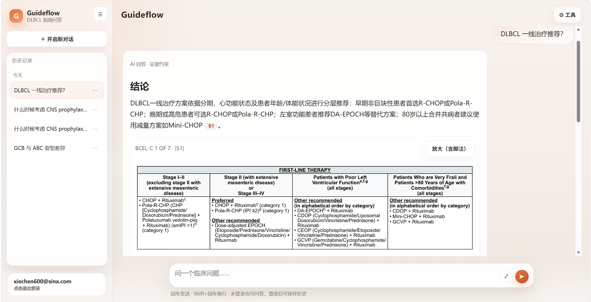
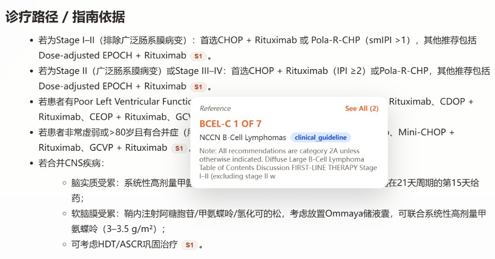
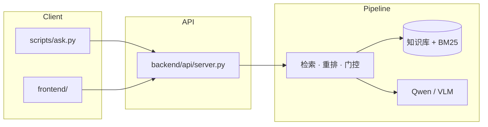

# Guideflow

> 基于 NCCN B 细胞淋巴瘤指南的证据约束问答 — CLI 与 Web 双入口，支持流程图多模态与引用溯源。

数据源：[NCCN B-Cell Lymphomas V3.2026](https://www.nccn.org/) PDF，默认聚焦 DLBCL（`BCEL` 模块），可扩展至 MCL、FL 等。

<p align="center">
  
</p>

<p align="center">
  
</p>

## Highlights

- **结构化知识库** — 解析整本 NCCN PDF：临床指南页、Discussion 语义块、参考文献条目
- **BM25 检索 + 词面重排** — 默认无需向量模型；中文问题自动中→英 query 扩展
- **流程图多模态** — 命中 `BCEL-*` 等决策页时，按需渲图交给 VLM 看图回答
- **Web 真流式** — SSE 逐字输出、引用悬浮卡、流程图内联放大、Trace / 证据 / 图谱调试抽屉
- **账号与历史** — 邮箱登录、会话持久化、分享只读链接（`share.html?token=`）

## Quick Start

首次部署请阅读 **[环境配置指南](docs/环境配置.md)**（venv、依赖、Qwen / VLM Key）。

```bash
# 1. 克隆并进入项目
git clone <repo-url> guideflow && cd guideflow

# 2. 创建虚拟环境并安装依赖
python -m venv .venv
# Windows: .\.venv\Scripts\Activate.ps1
# Linux/macOS: source .venv/bin/activate
pip install -r requirements.txt

# 3. 配置 API Key（复制后填入真实值）
# QWEN_API_KEY=...
# VLM_API_KEY=...   # 流程图问题需要；缺省则降级为证据摘要模式

# 4. 构建知识库与 BM25 索引
python scripts/build_knowledge_base.py
python scripts/build_bm25_index.py
```

### CLI 问答

```bash
python scripts/ask.py "DLBCL 一线治疗推荐？" --trace
```

### Web 问答

需要两个终端（或访问后端挂载的 `/app/`）：

```bash
# 终端 A — 后端 API (:8001)
python -m uvicorn backend.api.server:app --reload --host 127.0.0.1 --port 8001

# 终端 B — 前端静态服务 (:5173)
python -m http.server 5173 -d frontend --bind 127.0.0.1
# 或在 frontend/ 目录：npx --yes serve -l 5173
```

浏览器打开 http://127.0.0.1:5173/ ，或 http://127.0.0.1:8001/app/ 。

Web UI 功能、API 端点与验收清单见 **[前端开发指南](frontend/开发指南.md)**。

#### 本机预览手机端（不必打包上云）

前端无构建步骤，改完 `frontend/` 下 CSS/JS 后硬刷新即可；用 Chrome 设备模式在电脑上模拟手机布局。

1. **起前端**（任选其一，端口保持 `5173`）：

   ```bash
   # 项目根目录
   python -m http.server 5173 -d frontend --bind 127.0.0.1

   # 或进入 frontend/ 目录
   cd frontend
   npx --yes serve -l 5173
   ```

2. 浏览器打开 http://127.0.0.1:5173/ 。只验布局/遮挡时可不启后端；要联调问答则先起终端 A 的 API。

3. **Chrome 模拟手机**：
   - 按 `F12` 打开开发者工具
   - 再按 `Ctrl+Shift+M`（Mac：`Cmd+Shift+M`）打开设备工具栏，或点工具栏上的手机/平板图标
   - 顶部选 `iPhone` / `Pixel` 等预设，或 Dimensions 选 **Responsive** 后把宽度拖到 **&lt;900px**（本项目移动断点）
   - 改样式后用 `Ctrl+Shift+R` 硬刷新

4. **建议核对**：首次进入侧栏默认收起、主聊天区完整；点展开出现抽屉与遮罩；点遮罩 / 选历史 / 新建对话后侧栏收起；底部输入框始终可见。

> 可选：本机与手机同一 Wi‑Fi 时，用 `python -m http.server 5173 -d frontend --bind 0.0.0.0`，手机浏览器访问 `http://<电脑局域网IP>:5173`。布局类问题本地定版后，再一次性同步到服务器即可。

> **默认检索为 BM25-only**（单次问答 ≤30s 预算考虑）。向量 + RRF 融合代码保留，仅在召回不足时按需启用，见 [环境配置 · 向量检索](docs/环境配置.md)。

## Architecture



流水线细节、trace 事件与模块对应见 **[技术实现](docs/技术实现.md)**。

## Project Layout

```text
guideflow/
├── backend/          # FastAPI、问答流水线、鉴权、会话存储
├── frontend/         # 静态 Web UI（HTML / CSS / JS）
├── scripts/          # 知识库构建、索引、CLI 问答、检索调试
├── docs/             # 详细文档与截图
├── data/             # 知识库、索引、缓存（运行时生成）
├── config.yaml       # 路径、检索、裁剪等非密钥配置
└── requirements.txt
```

## Configuration

| 文件 | 用途 |
|------|------|
| `.env` | **密钥**：`QWEN_API_KEY`、`VLM_API_KEY`；Web 鉴权：`AUTH_SECRET` 等 |
| `config.yaml` | PDF 路径、`disease_scope`、检索 TopK、图导航预算、裁剪策略 |

`.env` 示例：

```text
QWEN_API_KEY=你的 DashScope Key
VLM_API_KEY=你的 VLM Key
AUTH_SECRET=生产环境请设强随机值
```

完整配置项、镜像与 hybrid 切换见 [环境配置指南](docs/环境配置.md)。数据模型与溯源路径见 [数据组织](docs/数据组织.md)。

## Development

```bash
# 检索调试（不调用大模型）
python scripts/inspect_retrieval.py "ABC亚型+IPI4分，R-CHOP是否合适?" --trace

# 构建知识图谱（Web 图谱路径展示依赖）
python scripts/build_knowledge_graph.py

# 运行测试
python -m pytest -q
```

修改 discussion 切片或链接边分类后，需按顺序重建：`build_knowledge_base.py` → `build_bm25_index.py`。

排错优先查看 `--trace` 生成的 `logs/runs/{run_id}.jsonl`，字段说明见 [技术实现 · Trace](docs/技术实现.md)。

## Documentation

| 文档 | 内容 |
|------|------|
| [环境配置](docs/环境配置.md) | venv、模型下载、索引构建、hybrid 切换 |
| [华为云部署指南](docs/华为云部署指南.md) | 首次上云：买 ECS、安全组、配置、systemd、发给试用者；日常更新可用本地 `ecs-deploy/`（不入库） |
| [数据组织](docs/数据组织.md) | 知识库结构、三类主对象、参考文献关联 |
| [技术实现](docs/技术实现.md) | 在线流水线、多模态选图、trace 说明 |
| [前端开发指南](frontend/开发指南.md) | Web UI 功能、API、本地启动、验收清单 |
| [项目说明 · 详细版](docs/项目说明-详细版.md) | 旧版完整 README（算法流程、输出格式等） |

## Limitations

- 默认 BM25-only，语义召回依赖中→英扩展；hybrid 需额外建向量索引且延迟显著增加
- 未配置 `VLM_API_KEY` 时，流程图问题降级为证据摘要模式（不读图）
- 关联参考文献默认最多展开 15 条
- **医学免责声明**：本工具仅用于指南证据整理与辅助检索，不替代临床医生判断
