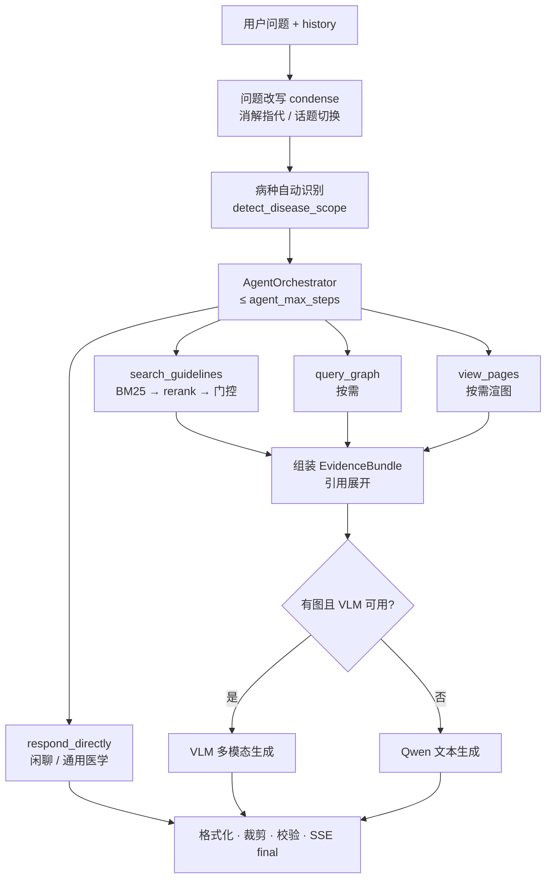
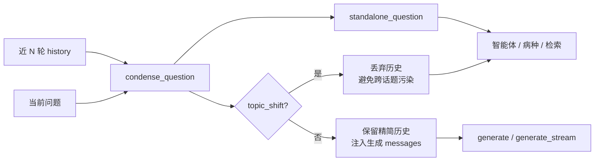

# NCCN B-Cell Lymphoma RAG Agent 技术实现

> 本文档描述**当前代码**的实现方式。数据字段与溯源路径见 [`数据组织.md`](./数据组织.md)；环境、模型与索引部署见 [`环境配置.md`](./环境配置.md)。

## 概述

Guideflow 是一个面向 NCCN B 细胞淋巴瘤指南（V3.2026）的 RAG 问答原型，提供 **CLI** 与 **Web** 两种入口。核心思路：

1. **离线**：把整本 PDF 解析为**多病种**结构化知识库，构建 **BM25 索引**与知识图谱（`GraphTriple`）。**无向量索引步骤。**
2. **在线（默认 agentic）**：多轮历史改写 → 病种自动识别 → **智能体工具循环**（检索 / 图谱 / 按需看图）→ 生成；或 `routing_mode: linear` 时走旧线性流水线（含意图早分支）。

**检索路径为 BM25-only**：不加载 embedding 模型，不维护向量库。流程图类问题通过智能体工具 `view_pages` **按需渲染** PNG，交给 VLM 看图回答。知识图谱由智能体按需调用 `query_graph` 补召回与路径推理；指南内回答仍以 `[Sn]` 为准。

## 目标与非目标

| 目标 | 非目标 |
|------|--------|
| 验证 NCCN B 细胞淋巴瘤指南 RAG 全链路 | 替代临床判断 |
| 覆盖临床指南页 + Discussion 正文（多病种已入库） | 向量语义检索 / hybrid 向量融合 |
| 中文问题 + 英文检索扩展 | 生产级多租户 / 高并发 |
| 智能体按需检索、看图、查图谱 | 离线预渲全部流程图 |
| 意图路由：指南证据 / 通用医学（标注）/ 闲聊 | 把通用医学回答伪装成指南证据 |
| 多轮追问（问题改写 + 精简历史）与抗话题污染 | 无限长上下文全量喂给模型 |
| 流程图问题图文并茂（按需） | — |

## 系统架构

```text
┌─────────────────────────────────────────────────────────────────┐
│                        离线构建                                  │
│  PDF ──► pdf_extractor（多病种自动切段）──► 知识库 JSON          │
│              ├──► BM25 索引 (pkl)                                │
│              └──► 知识图谱 JSON (GraphTriple，可选)                │
└─────────────────────────────────────────────────────────────────┘
                              │
                              ▼
┌─────────────────────────────────────────────────────────────────┐
│              在线问答（默认 routing_mode: agentic）               │
│  问题(+history) ──► 改写/话题切换 ──► 病种识别                   │
│       └─► AgentOrchestrator 工具循环（≤ agent_max_steps）      │
│              ├─ search_guidelines  → BM25 → rerank → 门控        │
│              ├─ query_graph        → KG 三元组（按需）           │
│              ├─ view_pages         → 按需渲页 → VLM 候选图       │
│              └─ respond_directly   → 闲聊/通用医学早退出         │
│       ──► 引用展开 ──► 生成(+历史) ──► 格式化 · 校验 · 输出     │
│                                                                  │
│  回退 routing_mode: linear → 意图分类早分支 + 固定线性检索选图   │
└─────────────────────────────────────────────────────────────────┘
```

**编排入口**：`backend/app/services/qa.py` 中的 `QAService.ask()` / `ask_stream()`。

**配置优先级**：环境变量 > `config.yaml` > 代码默认值（`backend/app/settings.py`）。

## 代码结构

```text
scripts/                    CLI 入口
  build_knowledge_base.py   PDF → 知识库
  build_bm25_index.py       知识库 → BM25
  build_knowledge_graph.py  知识库 → 知识图谱（可选）
  ask.py                    问答
  inspect_retrieval.py      仅检索调试

backend/app/
  models.py                 数据模型、GraphTriple、QAResult、to_web_payload
  settings.py               配置（paths、retrieval、routing、figure 预算等）
  prompts.py                集中提示词（含 [G] 图谱证据段、智能体 system）
  services/
    pdf_extractor.py        PDF 解析
    store.py / bm25_store.py  知识库与 BM25
    knowledge_graph.py      图谱构建 / 本体
    kg_retriever.py         图谱检索
    neo4j_importer.py       可选 Neo4j 导入
    agent_orchestrator.py   智能体工具循环
    agent_tools.py          工具 schema、status 事件、AgentState
    query_normalizer.py     问题归一化
    disease_scope.py        多病种 scope 注册表 + 自动识别
    retrieval.py            路由标签、Bm25Retriever（HybridRetriever 别名）
    reranker.py             LexicalReranker（默认）
    reference_resolver.py   句子级参考文献关联
    graph_navigator.py      流程图链接导航
    dlbcl_flow_map.py       DLBCL 意图 → seed 页
    page_image.py           按需渲页
    page_summary_cache.py   首次命中页摘要
    figure_selection.py     答案驱动裁剪
    figure_crop.py          展示框裁剪
    figure_anchor.py        段落锚点
    qwen.py                 改写/门控/文本生成/工具调用
    multimodal_client.py    VLM 看图
    answer_formatter.py     输出清洗
    verifier.py             引用校验（按 answer_kind）
    tracing.py              trace 日志
    qa.py                   问答总线
    auth.py / db.py         账号与会话持久化

backend/api/server.py       FastAPI（默认 :8001）
frontend/                   静态前端（对话、历史、分享、引用卡、步骤 UI）
data/processed/             知识库 JSON + knowledge_graph.json
data/indexes/               bm25_index.pkl（仅此）
data/cache/                 页图、页摘要
logs/runs/                  trace JSONL
```

## 离线流水线

### 1. PDF 解析

**模块**：`pdf_extractor.py` · **入口**：`scripts/build_knowledge_base.py`

使用 PyMuPDF 两遍扫描 PDF：

| 页区间 | 类型 | 处理方式 |
|--------|------|----------|
| 1–13 | `front_matter` | 封面、目录等 |
| 14–139 | `clinical_guideline` | 按页保存，提取 `printed_page_code`（如 `BCEL-C 1 OF 7`）、`module_code`、出站链接 |
| 140+ | `discussion` | 按物理结构（正文 → 参考文献 → 正文）切 article，再切语义 chunks |

要点：

- **Footer code**：右下角区域（`y > 85%`, `x > 50%`）正则匹配页码。
- **链接解析**：PyMuPDF 内部跳转反查目标 `printed_page_code`，bbox 重叠匹配锚文本。
- **边分类**（`classify_edge`）：`flow`（决策路径边）vs `navigation`（目录/页眉 chrome），供后续图导航使用。
- **Discussion 切段**（`_segment_discussion`）：边界由「参考文献页 → 正文页」状态切换决定；病名（`_DISEASE_ARTICLES`）仅用于贴 `article_id` 标签，不参与切分边界。因此 **FL/MCL/MZL 等病种与参考文献均已自动入库**，扩展检索只需改在线 `disease_scope`，不必手工再切 PDF。

**产出**：`data/processed/dlbcl_knowledge_base.json`（文件名历史遗留；内容为整本 B 细胞淋巴瘤）

### 2. 数据模型

**模块**：`models.py` · 详见 [`数据组织.md`](./数据组织.md)

三类主对象：

| 类型 | 用途 |
|------|------|
| `GuidelinePage` | 临床指南页（文本、页码、链接） |
| `DiscussionChunk` | Discussion 语义段落（含 `reference_ids`） |
| `ReferenceEntry` | 参考文献条目（PMID/DOI/URL） |

检索单元 `SearchDocument` 由 `kb.to_search_documents()` 扁平化生成。**`reference` 不进 BM25 相似度检索**，仅在回答时关联展开。

### 3. BM25 索引

**模块**：`bm25_store.py` · **入口**：`scripts/build_bm25_index.py`

- 自实现 BM25 + jieba 中文分词 + 正则 tokenization。
- 索引对象：`clinical_guideline` + `discussion` 对应的 `SearchDocument` 列表。
- 持久化：`data/indexes/bm25_index.pkl`（pickle：`documents` + `tokenized`）。

运行时，`PageSummaryCache` 会把首次命中缓存的页摘要**并入 BM25 语料**（内存重建，不写回 pkl），缓解流程图页 OCR 噪声导致的召回漏。

### 4. 知识图谱

**模块**：`knowledge_graph.py` · `kg_retriever.py` · **入口**：`scripts/build_knowledge_graph.py`

- 从结构化知识库抽取候选三元组，经本体（`MedicalOntology`）与规则校验后写出可信边。
- 产出：`data/processed/knowledge_graph.json`（ontology + trusted triples）。
- 在线由智能体工具 `query_graph` 或 linear 模式固定步骤调用 `KnowledgeGraphRetriever`；图谱文件缺失时降级为空图，不阻断问答。
- 可选：`neo4j_importer.py` 将图谱导入 Neo4j（日常问答不需要）。

## 在线流水线

### 总览（默认 agentic）



> **注意**：`route=hybrid` 表示问题同时含**流程图关键词**与**证据关键词**（见 `retrieval.route_query()`），影响 prompt 侧重点与选图策略；**与向量 hybrid 无关**（项目已移除向量检索）。

### SSE 流式协议

**模块**：`qa.ask_stream()` · `backend/api/server.py`

Web 默认 `stream: true`，响应 `text/event-stream`。事件顺序：

```text
meta → status* → token* → final
```

| 事件 `type` | 说明 |
|-------------|------|
| `meta` | 首轮元信息：`routing_mode`、`disease_scope`、`run_id` 等 |
| `status` | 智能体/生成阶段进度（见下表） |
| `token` | 答案增量文本 |
| `final` | 完整 `QAResult.to_web_payload()`，含 sources、figures、trace 等 |

**`status` 阶段**（`agent_tools.status_event` / `status_for_tool`）：

| `stage` | 典型 `label` | 触发时机 |
|---------|--------------|----------|
| `planning` | 规划中… | 智能体循环开始 |
| `search` | 检索指南中：「…」 | `search_guidelines` 或补充检索 |
| `graph` | 查询知识图谱中… | `query_graph` |
| `view_pages` | 读取流程图：BCEL-3、… | `view_pages` |
| `direct` | 准备直接回复… / 准备通用医学说明… | `respond_directly` |
| `fallback` | 回退到线性检索… | 无 API Key 或工具调用失败 |
| `generate` | 生成回答中… | 进入 LLM/VLM 生成 |

前端 `consumeSSE` 消费 `status` / `token` / `final`；步骤列表渲染见 [`frontend/开发指南.md`](../frontend/开发指南.md)。

### 多轮上下文与问题改写

**模块**：`qwen.condense_question()` · `prompts.CONDENSE_SYSTEM` · 前端 `app.js` / `AskRequest.history`

对齐常见对话产品做法：检索与智能体用**改写后的独立问题**，展示仍用用户原文。



| 步骤 | 行为 |
|------|------|
| 前端 | `/api/ask` 附带近几轮 `{role, content}`（默认约 6 条）；`conversation_id` 仅用于落库 |
| 改写 | LLM 把「它呢 / 这个方案」补全为可独立检索的问题；失败则原问回退 |
| 话题切换 | `topic_shift=true` 时清空 history，生成不再带旧轮次 |
| 生成 | 指南路径：`[system, *history, user(证据 prompt)]` |

Trace 事件：`query_condensed`

### 智能体工具循环（默认路径）

**模块**：`agent_orchestrator.py` · `agent_tools.py` · `qwen.run_tool_turn()`

配置：`routing_mode: agentic`（默认）、`agent_max_steps: 4`（默认）。

| 工具 | 作用 |
|------|------|
| `search_guidelines` | 调用 `Bm25Retriever`：归一化 query → BM25 → lexical rerank → 可选证据门控；更新 `AgentState.hits`、`route`、`candidate_pages` |
| `query_graph` | 调用 `KnowledgeGraphRetriever`，写入 `graph_hits` |
| `view_pages` | 按 `page_codes` 从候选清单点名，按需 `PageImageRenderer.render()`，受 `figure_ceiling` 限制 |
| `respond_directly` | `kind=chitchat|general_medical`，跳过指南检索，设置 `early_answer` |

循环逻辑要点：

1. 每步调用 Qwen **function calling**，解析 tool_calls 并 dispatch。
2. 模型可在 content 中输出 `{"ready": true, "route": "..."}` 提前结束（`extract_ready_payload`）。
3. **Seed 决策页**：`search_guidelines` 后通过 `dlbcl_flow_map.resolve_entry_page` 映射意图入口（如一线治疗 → `BCEL-3`）；门控后若 seed 不在 hits 中会 **合成注入**（`seed_hit_injected`）。
4. **候选页清单**：seed + 命中临床页 + 链接图邻居（`graph_navigator.expand`，深度/扇出见 `config.yaml` 的 `graph.*`），供 `view_pages` 点名。
5. 循环结束仍无 hits 时，**强制补充检索**一次 `search_guidelines`。
6. 若智能体未调用 `view_pages` 但 `route ∈ {flowchart, hybrid}`，`_context_from_agent_state` 会 **确定性回退** `_gather_figures()`（与 linear 相同逻辑）。
7. 无 `QWEN_API_KEY` 或工具轮失败时 `_linear_fallback`：单次检索 + 确定性选图。

Trace 事件：`agent_tool_call` · `agent_ready` · `agent_finished` · `agent_degraded`

### 线性模式（回退）

**配置**：`routing_mode: linear` 或环境变量 `ROUTING_MODE=linear`

**模块**：`qa._prepare_ask_linear()`

与旧版流水线一致：

1. `classify_intent` → `chitchat` / `general_medical` **早分支**直接生成。
2. `guideline` → 归一化 → `Bm25Retriever.retrieve()` → 门控 → 引用展开 → **固定** KG 检索 → `_gather_figures()` → 生成。

linear 模式不使用智能体工具循环；闲聊/通用医学仍走意图分类早退出。

Trace 事件：`intent_classified` · `early_answer`

### Query 归一化

**模块**：`query_normalizer.py`

- 正则抽取英文实体、基因名、突变位点、治疗缩写。
- 中文医学关键词映射到英文检索词（`TRANSLATION_HINTS`）。
- 输出 `search_queries`：原问 + 英文扩展 + 实体上下文，供 BM25 合并 token 打分。
- 输入一般为 **standalone_question**（改写结果）。

Trace 事件：`query_normalized`（linear 模式；agentic 在 `search_guidelines` 内调用）

### 问题路由与疾病范围

**模块**：`retrieval.route_query()` · `disease_scope.py` · `detect_disease_scope()`

**问题路由**（仅打标签，**不改变检索 page_types**）：

| route | 触发 | 检索 page_types |
|-------|------|-----------------|
| `flowchart` | 治疗路径类关键词 | `clinical_guideline` + `discussion` |
| `evidence` | 预后/突变/证据类关键词 | 同上 |
| `hybrid` | 两类关键词都有 | 同上 |

**疾病范围**（默认 `config.yaml`：`disease_scope: auto`）：

整本指南已离线切好多病种（discussion 按 article，临床页按 footer `module_code`）。在线仅做**过滤**，无需重新分割 PDF。

| scope key | 临床 `module_codes`（示例） | Discussion `article_ids` |
|-----------|----------------------------|--------------------------|
| `dlbcl` | BCEL + NHODG/DIAG… | dlbcl + overview |
| `fl` | FOLL + 公共 | fl + overview |
| `mcl` | MANT + 公共 | mcl + overview |
| `mzl` | MZL/NMZL/SMZL/EMZLG/EMZLNG + 公共 | mzl + overview |
| `pmbl` / `hgbl` / `burkitt` / `ptld` / `hiv` / `transform` | 对应模块 + 公共 | 对应 article + overview |
| `all` | `[]`（不过滤） | `[]`（不过滤） |

`MetadataFilters.matches`：列表为空表示该维度不过滤。公共模块（`NHODG` 支持治疗等）在识别到具体病种时自动并入。

Trace 事件：`query_routed` · `metadata_filters`

### BM25 检索与重排

**模块**：`bm25_store.py` · `retrieval.Bm25Retriever`（别名 `HybridRetriever`，兼容旧 import）

1. BM25 对全部 `search_queries` 的 token **合并去重**后统一打分（非逐条 query 取 max）。
2. `MetadataFilters.matches()` 在打分前过滤文档。
3. 取 Top-40（`bm25_top_k`）→ 截断至 rerank 候选集（`rerank_top_k=16`）。
4. **`LexicalReranker`** 词面 overlap 重排 → Final Top-6（`final_top_k`）。
5. 按 `source_id` 去重。

`QAService` **不加载** embedding 模型与 vector store；冷启动仅依赖 BM25 pkl + API 客户端。

Trace 事件：`retrieval_topk_raw` · `rerank_topk` · `retrieval_topk_final`（`retrieval_mode: bm25`）

### 证据门控

**模块**：`qwen.gate_evidence()`

Rerank 后，用廉价 Qwen 调用按 query 筛选保留的 `[Sn]` 证据。API 不可用时降级为词面 overlap。

- agentic：`search_guidelines` 内调用；`route ∈ {flowchart, hybrid}` 时 `protect_decision_pages=true`，并 reinject seed 页。
- 可通过 `config.yaml` 的 `enable_evidence_gating: false` 关闭。

Trace 事件：`evidence_gated`

### 参考文献关联（句子级）

**模块**：`reference_resolver.py`

1. 遍历门控后的 discussion 命中。
2. 按问题关键词选出**最相关句子**，优先抽取该句内的文献号；不足时再看邻句窗口。
3. 仅保留同时落在 chunk `reference_ids` 内的编号，去重后查 `ReferenceEntry`。
4. 硬顶 `retrieval.max_attached_refs`（默认 **6**）。

前端 `References` 块默认**折叠**。

Trace 事件：`attached_references`

### 知识图谱检索

**模块**：`kg_retriever.py`

- **Agentic**：仅当智能体调用 `query_graph` 时执行。
- **Linear**：每次 guideline 问答固定检索一次。

步骤：实体归一化 → 多跳扩展 `GraphTriple` → 写入 `EvidenceBundle.graph_triples` / `[G1]…` prompt 段。

### 回答生成

**模块**：`qwen.py` · `multimodal_client.py` · `prompts.py` · `answer_formatter.py`

| 条件 | 路径 | `generation_mode` / `answer_kind` |
|------|------|-----------------------------------|
| agent `respond_directly` 或 linear 早分支 chitchat | `generate_chitchat` | text / chitchat |
| agent `respond_directly` general_medical 或 linear 早分支 | `generate_general_medical` | text / general_medical |
| 有 `view_pages` / `_gather_figures` 图且 VLM 可用 | VLM 看图 | multimodal / guideline |
| 其他 guideline | Qwen 文本（可带 history） | text / guideline |

**后处理**（`format_answer()`）：剥离自生成来源段、过滤内部 ID、归一化 `[Sn]`。

**降级**：

| 条件 | degraded 标记 | 行为 |
|------|---------------|------|
| 无 `QWEN_API_KEY` | `qwen_api_unavailable` | 证据摘要 / 固定闲聊文案；智能体回退 linear 检索 |
| 无 `VLM_API_KEY` 或无图 | `vlm_api_unavailable` / `vlm_no_images` | 不读图，列文本证据 |
| 改写失败 | `condense_*` | 原问回退 |

Trace 事件：`multimodal_decision` · `prompt_built` · `answer_generated`

### 输出与校验

**引用校验**（`verifier.py`）：

- `answer_kind=guideline`：检查 `[Sn]`、未覆盖实体的边界声明；多模态时放宽实体覆盖。
- `chitchat` / `general_medical`：**不因缺 `[Sn]` 判失败**。

Trace 事件：`verification_result`

## 查询时多模态（按需看图）

核心思路：**索引阶段不预渲图、不建向量**；仅在智能体 `view_pages` 或 linear `_gather_figures` 时按需渲染并调用 VLM。

### Agentic：`view_pages`

**模块**：`agent_orchestrator._tool_view_pages()`

1. `page_codes` 必须来自 `candidate_pages` 或已有 hits（规范化 `printed_page_code`）。
2. 受 `figure_ceiling`（默认 4，与 `max_images` 联动）限制。
3. 未匹配时回退：优先 `decision` → `table` → `guideline` 类型候选。
4. 渲染后写入 `AgentState.figures`；若此前 `route=evidence` 且有图，升级为 `flowchart`。

### Linear / 回退：`_gather_figures`

**模块**：`qa._gather_figures()` · `graph_navigator.pick_seed()`

仅当 `route ∈ {flowchart, hybrid}`：

1. **Phase 1 — Seed 决策页**：意图映射入口（如 workup→`BCEL-2`、一线→`BCEL-3`），**优先于**方案表页，避免被挤占。
2. **Phase 2 — 证据命中页**：门控后 `clinical_guideline` 命中，决策页优先于表格页。
3. **Phase 3 — 链接图邻居**：从 seed 出发，仅跟 `flow` 边；深度 `graph.depth`、扇出 `graph.fanout`。
4. 预算：`figure_ceiling` / `max_images`（默认 4）。
5. **答案驱动裁剪**（`figure_selection.prune_figures_by_answer`）：生成后只保留回答引用的页；展示上限 `display_max_figures`（默认 4）。

Trace 事件：`figures_gathered` · `figures_pruned` · `figures_cropped`

### 按需渲染与展示裁剪

**模块**：`page_image.py` · `figure_crop.py`

- PyMuPDF `get_pixmap(dpi=150)` 按需渲页；缓存 `data/cache/page_images/`。
- 默认 `crop.prefer: auto`：表格 → 流程图 compact/full → 文本块兜底；Web 默认 compact，可「放大（含脚注）」看 full。

### 首次命中页摘要

**模块**：`page_summary_cache.py`

VLM 在同一次看图回答中产出页摘要（`===PAGE_SUMMARY_JSON===`），写入 `data/cache/page_summaries.json`，下次启动并入 BM25 语料。

Trace 事件：`page_summaries_cached`

## Web API 与前端

### API

**模块**：`backend/api/server.py` · **启动**：`python -m uvicorn backend.api.server:app --host 127.0.0.1 --port 8001`

| 端点 | 说明 |
|------|------|
| `GET /health` / `GET /api/health` | 健康检查 |
| `POST /api/ask` | 问答；默认 **SSE 流式**（`status*` + `token*` + `final`）；按树挂接消息 |
| `GET /api/images/{filename}` | 安全返回 PNG |
| `/api/auth/*` · `/api/conversations/*` · `/api/shared/{token}` | 账号、会话树、分享（分享为激活路径线性化） |
| `POST /api/conversations/{id}/active-branch` | 切换激活兄弟分支 |
| `DELETE /api/messages/{id}` | 删除节点及其整棵子树 |

`AskRequest` 字段：

| 字段 | 说明 |
|------|------|
| `question` | 当前用户问题 |
| `history` | 可选，近几轮 `{role, content}`（应为激活路径） |
| `conversation_id` | 可选，登录用户落库续聊 |
| `parent_message_id` | 可选，挂接到的父节点；追问传助手叶子，重说传用户节点 |
| `regenerate` | `true` 时只新建助手兄弟（不新建用户） |
| `stream` / `trace` | 流式（默认 true）、trace 日志 |

会话消息为树：`Message.parent_id` / `active_child_id`，`Conversation.active_root_id`。启动时 `init_db()` 幂等迁移并回填旧线性数据。前端渲染激活路径，详见 [`开发指南.md`](../frontend/开发指南.md)。

### 前端

**目录**：`frontend/` · 详见 [`开发指南.md`](../frontend/开发指南.md)

## 配置

### 密钥（`.env`）

```text
QWEN_API_KEY=...
VLM_API_KEY=...          # 或 DASHSCOPE_API_KEY
```

以 `utf-8-sig` 读取，避免 BOM 导致首行 Key 失效。

### 业务参数（`config.yaml`）

| 分组 | 常用项 | 默认 |
|------|--------|------|
| `paths.*` | pdf、knowledge_base、bm25_index、knowledge_graph、page_images、summary_cache、logs | 见项目根目录文件 |
| `retrieval.*` | bm25_top_k / rerank_top_k / final_top_k / max_attached_refs | 40 / 16 / 6 / 6 |
| `routing_mode` | `agentic` \| `linear` | `agentic` |
| `agent_max_steps` | 智能体最大工具轮数 | 4 |
| `figure_ceiling` / `max_images` / `display_max_figures` | 看图与展示上限 | 4 / 4 / 4 |
| `disease_scope` | `auto` / 病种 key / `all` | `auto` |
| `graph.*` | fanout / depth / reserve | 3 / 1 / 2 |
| `enable_evidence_gating` | 证据门控开关 | true |
| `crop.*` | enabled、prefer、padding | auto |
| `qwen.*` / `vlm.*` | base_url、model | qwen-plus / qwen-vl-max |
| Neo4j（可选，`.env`） | `NEO4J_*` | 仅导入时需要 |

完整环境搭建见 [`环境配置.md`](./环境配置.md)。

## Trace 调试

**模块**：`tracing.py` · **路径**：`logs/runs/{YYYYMMDD-HHMMSS-uuid8}.jsonl`

| 事件 | 检查什么 |
|------|----------|
| `query_condensed` | 独立问题改写、`topic_shift` |
| `agent_tool_call` / `agent_finished` | 智能体工具链、route、图数量 |
| `intent_classified` / `early_answer` | linear 模式意图与早分支 |
| `query_routed` / `metadata_filters` | 病种过滤 |
| `retrieval_topk_raw` / `rerank_topk` | BM25 与重排 |
| `evidence_gated` | 门控保留的 `[Sn]` |
| `figures_gathered` / `figures_pruned` | seed、按需看图、裁剪 |
| `attached_references` | 句子级引用是否过宽 |
| `answer_generated` | generation_mode、`answer_kind` |
| `verification_result` | 引用校验 |

CLI 加 `--trace` 会在输出末尾打印 trace 文件路径。

## 测试

```bash
python -m pytest -q
```

| 测试文件 | 覆盖 |
|----------|------|
| `test_pdf_extractor.py` | 解析、切段、reference |
| `test_retrieval.py` | 归一化、病种识别、路由、BM25 |
| `test_agent_and_kg.py` | 智能体工具、图谱 |
| `test_graph_navigator.py` | 链接图导航 |
| `test_figure_selection*.py` / `test_qa_figures.py` | 选图、裁剪 |
| `test_verifier.py` | 引用校验、format_answer |
| `test_auth_api.py` | 鉴权、会话、流式 ask |

## 当前限制

- 检索为 BM25 + 词面 rerank，语义召回依赖中→英 query 扩展与智能体多步检索。
- 未配置 `VLM_API_KEY` 时，流程图问题降级为文本证据（不读图）。
- 病种识别为规则/正则；未写出病名时回退全库，可能混入其他病种证据。
- 智能体每步工具调用增加 LLM 延迟；`agent_max_steps` 与 `figure_ceiling` 需按延迟预算调节。
- 流程图 seed 映射仍偏 DLBCL（`dlbcl_flow_map.py`）；其他病种流程图导航能力弱于 BCEL。
- 知识图谱偏规则/本体抽取；图谱缺失时自动降级为空图。
- 医学回答（含标注的通用医学）仅供辅助检索与科普，不替代临床判断。
