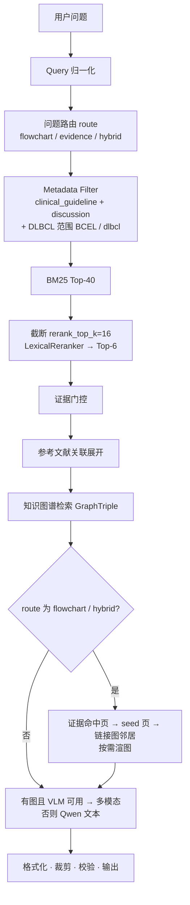

# NCCN B-Cell Lymphoma RAG Agent 技术实现

> 本文档描述**当前代码**的实现方式。数据字段与溯源路径见 [`数据组织.md`](./数据组织.md)；环境、模型与索引部署见 [`环境配置.md`](./环境配置.md)。

## 概述

Guideflow 是一个面向 NCCN B 细胞淋巴瘤指南（V3.2026）的 RAG 问答原型，提供 **CLI** 与 **Web** 两种入口。核心思路：

1. **离线**：把 PDF 解析为结构化知识库，构建 BM25 索引与知识图谱（`GraphTriple`）。
2. **在线**：中文问题 → 归一化与路由 → BM25 检索 → 词面重排 → 证据门控 → 参考文献展开 → 知识图谱检索 → 按需选图 → Qwen / VLM 生成 → 格式化与校验。

**默认检索路径为 BM25-only**，不加载 embedding 模型，满足单次问答延迟预算（≤30s）。流程图类问题走**查询时多模态**：命中决策页后按需渲染 PNG，交给 VLM 看图回答。知识图谱用于补召回与路径推理，回答仍以 `[Sn]` 指南/讨论证据为准。

## 目标与非目标

| 目标 | 非目标 |
|------|--------|
| 验证 NCCN 专病指南 RAG 全链路 | 生产级鉴权、会话历史、流式输出 |
| 覆盖临床指南页 + Discussion 正文 | 替代临床判断 |
| 中文问题 + 英文检索扩展 | 默认启用向量检索（代码保留，按需切换） |
| 流程图问题图文并茂 | 多疾病并行服务（当前仅 DLBCL） |

## 系统架构

```text
┌─────────────────────────────────────────────────────────────────┐
│                        离线构建                                  │
│  PDF ──► pdf_extractor ──► 知识库 JSON                          │
│              ├──► BM25 索引 (pkl)                                │
│              └──► 知识图谱 JSON (GraphTriple)                    │
└─────────────────────────────────────────────────────────────────┘
                              │
                              ▼
┌─────────────────────────────────────────────────────────────────┐
│                        在线问答                                  │
│  问题 ──► 归一化 ──► 路由/过滤 ──► BM25 ──► LexicalReranker    │
│       ──► 证据门控 ──► 参考文献展开 ──► KG 检索                  │
│       ──► [选图] ──► 生成 ──► 输出                               │
└─────────────────────────────────────────────────────────────────┘
```

**编排入口**：`backend/app/services/qa.py` 中的 `QAService.ask()`。

**配置优先级**：环境变量 > `config.yaml` > 代码默认值（`backend/app/settings.py`）。

## 代码结构

```text
scripts/                    CLI 入口
  build_knowledge_base.py   PDF → 知识库
  build_bm25_index.py       知识库 → BM25
  build_knowledge_graph.py  知识库 → 知识图谱
  ask.py                    问答
  inspect_retrieval.py      仅检索调试

backend/app/
  models.py                 数据模型、GraphTriple、QAResult、to_web_payload
  settings.py               配置与 EMBEDDING_PROFILES
  prompts.py                集中提示词（含 [G] 图谱证据段）
  services/
    pdf_extractor.py        PDF 解析
    store.py / bm25_store.py  知识库与 BM25
    knowledge_graph.py      图谱构建 / 本体
    kg_retriever.py         图谱检索
    neo4j_importer.py       可选 Neo4j 导入
    query_normalizer.py     问题归一化
    retrieval.py            路由、检索、RRF（可选）
    reranker.py             LexicalReranker（默认）
    reference_resolver.py   参考文献关联
    graph_navigator.py      流程图链接导航
    dlbcl_flow_map.py       DLBCL 意图 → seed 页
    page_image.py           按需渲页
    page_summary_cache.py   首次命中页摘要
    figure_selection.py     答案驱动裁剪
    figure_crop.py          展示框裁剪
    figure_anchor.py        段落锚点
    qwen.py                 文本生成、证据门控
    multimodal_client.py    VLM 看图
    answer_formatter.py     输出清洗
    verifier.py             引用校验
    tracing.py              trace 日志
    qa.py                   问答总线

backend/api/server.py       FastAPI（默认 :8001）
frontend/                   OpenEvidence 风格静态前端（index.html / app.js / styles.css）
data/processed/             知识库 JSON + knowledge_graph.json
data/indexes/               BM25 / 向量索引
data/cache/                 页图、页摘要
logs/runs/                  trace JSONL
```

## 离线流水线

### 1. PDF 解析

**模块**：`pdf_extractor.py` · **入口**：`scripts/build_knowledge_base.py`

使用 PyMuPDF 两遍扫描 PDF：

| 页区间 | 类型 | 处理方式 |
|--------|------|----------|
| 1–13 | `front_matter` | 封面、目录等 |
| 14–139 | `clinical_guideline` | 按页保存，提取 `printed_page_code`（如 `BCEL-C 1 OF 7`）、`module_code`、出站链接 |
| 140+ | `discussion` | 按物理结构（正文 → 参考文献 → 正文）切 article，再切语义 chunks |

要点：

- **Footer code**：右下角区域（`y > 85%`, `x > 50%`）正则匹配页码。
- **链接解析**：PyMuPDF 内部跳转反查目标 `printed_page_code`，bbox 重叠匹配锚文本。
- **边分类**（`classify_edge`）：`flow`（决策路径边）vs `navigation`（目录/页眉 chrome），供后续图导航使用。
- **Discussion 切段**（`_segment_discussion`）：边界由「参考文献页 → 正文页」状态切换决定；病名仅用于贴标签，不参与切分边界。

**产出**：`data/processed/dlbcl_knowledge_base.json`

### 2. 数据模型

**模块**：`models.py` · 详见 [`数据组织.md`](./数据组织.md)

三类主对象：

| 类型 | 用途 |
|------|------|
| `GuidelinePage` | 临床指南页（文本、页码、链接） |
| `DiscussionChunk` | Discussion 语义段落（含 `reference_ids`） |
| `ReferenceEntry` | 参考文献条目（PMID/DOI/URL） |

检索单元 `SearchDocument` 由 `kb.to_search_documents()` 扁平化生成。**`reference` 不进相似度索引**，仅在回答时关联展开。

### 3. BM25 索引

**模块**：`bm25_store.py` · **入口**：`scripts/build_bm25_index.py`

- 自实现 BM25 + jieba 中文分词 + 正则 tokenization。
- 索引对象：`clinical_guideline` + `discussion` 对应的 `SearchDocument` 列表。
- 持久化：`data/indexes/bm25_index.pkl`（pickle：`documents` + `tokenized`）。

运行时，`PageSummaryCache` 会把首次命中缓存的页摘要**并入 BM25 语料**（内存重建，不写回 pkl），缓解流程图页 OCR 噪声导致的召回漏。

### 4. 知识图谱

**模块**：`knowledge_graph.py` · `kg_retriever.py` · **入口**：`scripts/build_knowledge_graph.py`

- 从结构化知识库抽取候选三元组，经本体（`MedicalOntology`）与规则校验后写出可信边。
- 产出：`data/processed/knowledge_graph.json`（ontology + trusted triples）。
- 在线由 `KnowledgeGraphRetriever` 做实体归一化与多跳扩展；图谱文件缺失时降级为空图，不阻断问答。
- 可选：`neo4j_importer.py` 将图谱导入 Neo4j（日常问答不需要）。

## 在线流水线

### 总览



> **注意**：`route=hybrid`（问题同时含路径与证据关键词）与 `RETRIEVAL_MODE=hybrid`（向量融合）是**不同概念**。前者影响选图与 prompt；后者是可选检索模式，见文末附录。

### Query 归一化

**模块**：`query_normalizer.py`

- 正则抽取英文实体、基因名、突变位点、治疗缩写。
- 中文医学关键词映射到英文检索词（`TRANSLATION_HINTS`）。
- 输出 `search_queries`：原问 + 英文扩展 + 实体上下文，供 BM25 合并 token 打分。

Trace 事件：`query_normalized`

### 问题路由与疾病范围

**模块**：`retrieval.route_query()` · `disease_scope.py`

**问题路由**（仅打标签，**不改变检索策略**）：

| route | 触发 | 检索范围 |
|-------|------|----------|
| `flowchart` | 治疗路径类关键词 | `clinical_guideline` + `discussion` |
| `evidence` | 预后/突变/证据类关键词 | 同上 |
| `hybrid` | 两类关键词都有 | 同上 |

**疾病范围**（当前默认 DLBCL，`TARGET_DISEASE_SCOPE=dlbcl`）：

| 过滤维度 | 值 |
|----------|-----|
| 临床指南页 | `module_codes=["BCEL"]` |
| Discussion | `article_ids=["dlbcl"]` |

`reference` 不参与 BM25 / rerank；Discussion 命中后由 `ReferenceResolver` 按 `reference_ids` 从知识库直查展开，不占 top-k 名额（默认最多 15 条）。

Trace 事件：`query_routed` · `metadata_filters`

### BM25 检索与重排

**模块**：`bm25_store.py` · `retrieval.HybridRetriever` · `reranker.py`

默认路径（`retrieval.mode: bm25`）：

1. BM25 对全部 `search_queries` 的 token **合并去重**后统一打分（非逐条 query 取 max）。
2. `MetadataFilters.matches()` 在打分前过滤文档。
3. 取 Top-40（`bm25_top_k`）→ 截断至 rerank 候选集（`rerank_top_k=16`）。
4. **`LexicalReranker`** 词面 overlap 重排 → Final Top-6（`final_top_k`）。
5. 按 `source_id` 去重。

`QAService` 在 BM25-only 模式下**不加载** embedding 模型与 vector store（`qa.py` 第 44–48 行），这是冷启动延迟的主要优化。

Trace 事件：`retrieval_topk_raw` · `rerank_topk` · `retrieval_topk_final`

### 证据门控

**模块**：`qwen.gate_evidence()`

Rerank 后，用廉价 Qwen 调用按 query 筛选保留的 `[Sn]` 证据。API 不可用时降级为词面 overlap。

可通过 `config.yaml` 的 `enable_evidence_gating: false` 关闭。

Trace 事件：`evidence_gated`

### 参考文献关联

**模块**：`reference_resolver.py`

Rerank / 门控完成后：

1. 遍历 `primary_hits` 中的 discussion 块。
2. 读取 `reference_ids` + `article_id`，从知识库索引表查 `ReferenceEntry`。
3. 去重组装 `attached_references` 与 `reference_links`（discussion `[Sn]` → ref 编号）。

### 知识图谱检索

**模块**：`kg_retriever.py`

在参考文献展开之后、选图/生成之前顺序执行（不阻断主检索；图谱文件缺失时返回空结果）：

1. 从问题中解析本体实体（或回退关键词匹配）。
2. 按 `graph.depth` 多跳扩展相关 `GraphTriple`，取 Top-`final_top_k`。
3. 写入 `EvidenceBundle.graph_triples` / `graph_context`，并进入 prompt 的 `[G1]…` 段。
4. 结构化 `trace` 中记录 `graph_steps`、`evidence_hits`、`rerank_comparison`，供 OpenEvidence 前端调试面板使用。

### 回答生成

**模块**：`qwen.py` · `multimodal_client.py` · `prompts.py` · `answer_formatter.py`

**分流逻辑**（`QAService.ask()`）：

| 条件 | 路径 | generation_mode |
|------|------|-----------------|
| route ∈ {flowchart, hybrid} 且有可渲染流程图 + VLM 可用 | VLM 看图 | `multimodal` |
| 其他 | Qwen 文本 | `text` |

**提示词**（`prompts.py`）：

- `SYSTEM_PROMPT` / `MULTIMODAL_SYSTEM_PROMPT`：约束仅依据证据回答、标注 `[Sn]`、禁止自列来源。
- `ROUTE_GUIDANCE`：按 route 追加路径/证据侧重点。
- `build_evidence_prompt()`：组装 primary hits（`[S1]…`）与关联参考文献。

**后处理**（`format_answer()`）：

- 剥离模型自生成的来源/参考文献段。
- 过滤泄露的内部 ID（`ref-dlbcl-*`、`page-*` 等）。
- 归一化 `[S n]` → `[Sn]`。

**降级**：

| 条件 | degraded 标记 | 行为 |
|------|---------------|------|
| 无 `QWEN_API_KEY` | `qwen_api_unavailable` | 证据摘要模式 |
| 无 `VLM_API_KEY` 或无图 | `vlm_api_unavailable` / `vlm_no_images` | 不读图，列文本证据 |

Trace 事件：`multimodal_decision` · `prompt_built` · `answer_generated`

### 输出与校验

**引用校验**（`verifier.py`）：

- 检查 `[Sn]` 引用格式与去重计数。
- 问题实体未在证据中出现时，要求「指南未直接提及」类边界声明。
- 多模态答案（`figures` 非空）时放宽实体覆盖要求（图片接地）。

**CLI 输出**（`scripts/ask.py`）：

```text
## 结论
（含 [Sn] 与内联流程图）

## 指南依据
...

【证据来源】
[S1] BCEL-C 1 OF 7 | clinical_guideline | ...

【关联参考文献】
[27] Author, et al. ... (由 S1 关联)
```

Trace 事件：`verification_result`

## 查询时多模态

核心思路：**索引便宜通用，看图按需付费**。索引阶段不预渲图、不建向量；命中流程图页时才按需渲染并调用 VLM。

### 选图流程

**模块**：`dlbcl_flow_map.py` · `graph_navigator.py` · `qa._gather_figures()`

1. **仅当** `route ∈ {flowchart, hybrid}` 时选图；否则返回空图列表，走纯文本生成。
2. **Phase 1 — 证据命中页**：优先渲染门控后 `clinical_guideline` 命中页（尤其靠前的 `[Sn]`）。
3. **Phase 2 — Seed**：硬编码 DLBCL 意图 → 入口决策页（如 workup→`BCEL-2`、一线→`BCEL-3`）；未命中则取排名最高的数字决策页；若尚未在 Phase 1 中则补渲。
4. **Phase 3 — 链接图邻居**：从 seed 出发，仅跟 `flow` 边、同 `module_code` 前缀；深度 `graph.depth`、扇出 `graph.fanout`；同一页多条 flow 边时按 query 与锚文本/页摘要 overlap 排序。
5. **硬顶预算**：总图数不超过 `max_images`（`config.yaml` 可调，默认 1）。配置项 `graph.reserve` 目前仅保留在 settings，选图逻辑未单独预留名额。
6. **答案驱动裁剪**（`figure_selection.prune_figures_by_answer`）：生成后只保留回答中引用的页码/图；展示上限 `display_max_figures`（默认 2）。

Trace 事件：`figures_gathered` · `figures_pruned`

### 按需渲染

**模块**：`page_image.py`

- PyMuPDF `get_pixmap(dpi=150)` 按需渲页。
- 磁盘缓存：`data/cache/page_images/<pdf>_p<page>_<dpi>.png`。

### 展示裁剪

**模块**：`figure_crop.py`

默认 `crop.prefer: auto`——确定性几何优先，VLM bbox 仅兜底：

| 检测顺序 | 对象 |
|----------|------|
| `find_tables(lines_strict)` | 表格（单框） |
| `cluster_drawings` + 文本块 | 流程图 compact / full 双框 |
| 大文本块并集 | 兜底 |

流程图 **compact** 视图仅含决策树本体；**full** 视图含页底脚注。Web 前端默认展示 compact，可点击「放大（含脚注）」查看 full。

Trace 事件：`figures_cropped`

### 首次命中页摘要

**模块**：`page_summary_cache.py`

VLM 在同一次看图回答中顺带产出页摘要（`===PAGE_SUMMARY_JSON===` 块），写入 `data/cache/page_summaries.json`。下次启动时并入 BM25 语料，提升流程图页召回。成本随使用量增长，不随语料规模线性增长。

Trace 事件：`page_summaries_cached`

## Web API 与前端

### API

**模块**：`backend/api/server.py` · **启动**：`python -m uvicorn backend.api.server:app --host 127.0.0.1 --port 8001`（或 `python -m backend.api`，默认 :8001）

| 端点 | 说明 |
|------|------|
| `GET /health` / `GET /api/health` | 健康检查 |
| `POST /api/ask` | 问答，返回 `QAResult.to_web_payload()`（当前为非流式 JSON；前端若请求 SSE 会自动回退） |
| `GET /api/images/{filename}` | 安全返回 PNG（防路径穿越，支持 Unicode 文件名） |

请求体可选字段：`embedding`、`trace`、`stream`。`stream=true` 时返回 SSE（先完整生成，再按块推送 `token`，最后发 `final` payload）。

### 前端

**目录**：`frontend/` · **开发**：`python -m http.server 5173 -d frontend --bind 127.0.0.1`

OpenEvidence 风格静态前端（`index.html` / `app.js` / `styles.css`）：

| 能力 | 说明 |
|------|------|
| 对话区 | 渲染 `answer_markdown`，展示 `[Sn]` / `[G]` chips 与流程图图片 |
| 证据面板 | 证据来源、流程图、图谱路径、模板与收藏 |
| Trace 调试 | `retrieval_stages` / `rerank_comparison` / `graph_steps` / verification |
| 降级 | 后端不可用时展示内置示例数据 |

默认请求 `http://127.0.0.1:8001/api/ask`；可用 `window.API_BASE` 覆盖。

**Web 载荷**（`QAResult.to_web_payload()`）核心字段：

```json
{
  "answer_markdown", "answer_paragraphs",
  "figures[]": { "image_url", "full_image_url", "anchor_paragraph", "page_code", ... },
  "sources", "attached_references", "reference_links",
  "graph_triples",
  "verification", "degraded", "generation_mode",
  "run_id", "trace_path",
  "trace": {
    "retrieval_stages", "evidence_hits", "rerank_comparison",
    "graph_steps", "panel_hint", "verification"
  }
}
```

## 配置

### 密钥（`.env`）

```text
QWEN_API_KEY=...
VLM_API_KEY=...          # 或 DASHSCOPE_API_KEY
```

以 `utf-8-sig` 读取，避免 BOM 导致首行 Key 失效。

### 业务参数（`config.yaml`）

| 分组 | 常用项 | 默认 |
|------|--------|------|
| `paths.*` | pdf、knowledge_base、bm25_index、knowledge_graph、page_images | 见项目根目录文件 |
| `retrieval.*` | mode、top_k 系列 | `mode: bm25`，final 6 |
| `disease_scope` | 疾病 key | `dlbcl` |
| `graph.*` | fanout / depth / reserve | 3 / 1 / 2（reserve 已配置，选图暂未单独使用） |
| `max_images` / `display_max_figures` | 选图（送 VLM）与展示上限 | 1 / 2 |
| `crop.*` | enabled、prefer、padding | auto |
| `qwen.*` / `vlm.*` | base_url、model | qwen-plus / qwen-vl-max |
| Neo4j（可选，`.env`） | `NEO4J_URI` / `NEO4J_USER` / `NEO4J_PASSWORD` | 仅导入时需要 |

提示词模板集中在 [`backend/app/prompts.py`](../../backend/app/prompts.py)。

## Trace 调试

**模块**：`tracing.py` · **路径**：`logs/runs/{YYYYMMDD-HHMMSS-uuid8}.jsonl`

每次问答一行 JSON 事件。排查顺序建议：

| 事件 | 检查什么 |
|------|----------|
| `query_normalized` | 英文扩展是否正确 |
| `metadata_filters` | 是否只检索 guideline + discussion |
| `retrieval_topk_raw` | BM25 top-k 是否合理 |
| `rerank_topk` | 重排后证据是否更贴近问题 |
| `evidence_gated` | 门控保留了哪些 `[Sn]` |
| `reasoning_path` / `graph_steps` | 图谱路径与结构化调试信息 |
| `figures_gathered` / `figures_pruned` | seed、邻居、最终输出图 |
| `attached_references` | 参考文献编号是否正确 |
| `answer_generated` | generation_mode、使用的 source |
| `verification_result` | 引用与边界声明 |

CLI 加 `--trace` 会在输出末尾打印 trace 文件路径。

## 测试

```bash
python -m pytest -q
```

| 测试文件 | 覆盖 |
|----------|------|
| `test_pdf_extractor.py` | 解析、切段、reference |
| `test_retrieval.py` | 归一化、路由、BM25、metadata filter |
| `test_graph_navigator.py` | 链接图导航 |
| `test_figure_selection.py` / `test_qa_figures.py` | 选图、裁剪 |
| `test_verifier.py` | 引用校验、format_answer |

## 附录：可选向量检索（hybrid）

> **非默认路径。** 受延迟预算约束，日常部署无需建向量索引。代码完整保留，仅在 BM25 + 中→英扩展召回明显不足时按需启用。

**切换方式**（二选一）：

```powershell
# 临时（CLI）
python scripts/build_vector_index.py --embedding bge-m3   # 首次需建索引
python scripts/ask.py "问题" --embedding bge-m3 --trace

# 持久（config / 环境变量）
# retrieval.mode: hybrid
# embedding.model: BAAI/bge-m3
```

启用后，`HybridRetriever` 增加向量一路（Top-12），BM25 与向量结果经 RRF（k=60）融合后再 rerank。`bge-m3` profile 会尝试加载 `CrossEncoderReranker`，失败则回退 `LexicalReranker`。

`hash` profile 可用于秒级验证 hybrid 链路（无语义，仅调试用）：

```powershell
python scripts/build_vector_index.py --embedding hash
python scripts/ask.py "问题" --embedding hash
```

Profile 注册表见 `settings.EMBEDDING_PROFILES`；每个 profile 有独立向量索引目录，避免向量空间错配。模型下载、镜像与排错详见 [`环境配置.md`](./环境配置.md)。

## 当前限制

- 默认 BM25-only，语义召回依赖中→英 query 扩展。
- 未配置 `VLM_API_KEY` 时，流程图问题降级为证据摘要（不读图）。
- 疾病范围当前仅 DLBCL；扩展需在 `disease_scope.py` 注册。
- Discussion article 边界依赖 PDF 物理结构，极端排版仍可能切不准。
- 知识图谱当前偏规则/本体抽取，质量依赖校验阈值；图谱缺失时自动降级为空图。
- Web 为 OpenEvidence 静态前端原型；鉴权、历史服务端持久化未实现。`stream=true` 为生成完成后按块推送的伪 SSE，非真正边生成边推送。
- 医学回答仅供指南证据整理与辅助检索，不替代临床判断。
