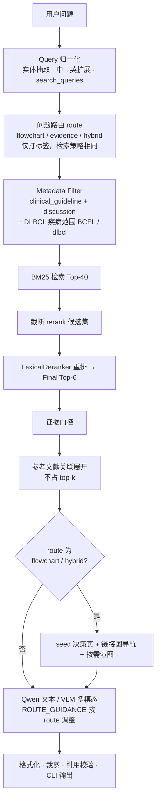

# 项目说明 · 详细版

> 本文档为旧版根目录 README 的归档，保留完整算法流程、输出格式与排错说明。  
> 仓库首页请阅读 [README.md](../README.md)；Web 前端见 [frontend/开发指南.md](../frontend/开发指南.md)。

面向 B-Cell Lymphoma 诊疗指南问答的 RAG 系统（CLI + Web）。数据源为 NCCN B-Cell Lymphomas V3.2026 PDF，覆盖全部疾病模块（DLBCL、MCL、FL 等）。

## 快速开始

首次部署请阅读 **[环境配置指南](环境配置.md)**（含 venv 激活、Qwen / VLM Key 配置）。向量模型下载与 hybrid 检索仅在需要切换向量模式时参考该文档。

> Windows / PowerShell 注意：所有命令都要在项目虚拟环境 `.venv` 中运行。

```powershell
# 1) 允许激活 venv
Set-ExecutionPolicy -Scope CurrentUser -ExecutionPolicy RemoteSigned
.\.venv\Scripts\Activate.ps1     # 提示符出现 (.venv) 即成功

# 2) 构建知识库与 BM25 索引（默认检索路径，无需向量模型）
python scripts/build_knowledge_base.py
python scripts/build_bm25_index.py

# 3) 问答（CLI）
python scripts/ask.py "ABC亚型+IPI4分，R-CHOP是否合适?" --trace

# 4) 问答（Web）
# 终端 A: python -m uvicorn backend.api.server:app --reload --host 127.0.0.1 --port 8001
# 终端 B: python -m http.server 5173 -d frontend --bind 127.0.0.1
# 浏览器打开 http://127.0.0.1:5173
```

> **默认检索为 BM25-only**（受单次问答 ≤30s 约束：本地 CPU 加载 embedding 模型 + 编码 query 通常就会超预算）。日常只需 BM25 索引；中→英 query 扩展负责补语义召回。
>
> **流程图问题走查询时多模态**：命中流程图页（如 `BCEL-*`）时按需把该页渲染成图片交给 VLM（默认 Qwen-VL）看图回答，输出图文并茂；纯文本问题走 Qwen。需配置 `VLM_API_KEY`，否则自动降级为「证据摘要模式」。
>
> 修改了 discussion 切片或链接边分类后，需重建：`build_knowledge_base.py` → `build_bm25_index.py`。

如果不想改执行策略，也可以不激活、直接用 venv 的解释器：

```powershell
.\.venv\Scripts\python.exe scripts/ask.py "ABC亚型+IPI4分，R-CHOP是否合适?" --trace
```

### 可选：切换到向量检索（hybrid）

> 向量 + RRF 融合路径**代码仍保留**，但当前项目**默认不用**（性能与部署成本考虑）。仅在语义改写很强、BM25 召回明显不足时再启用。

两种方式（二选一）：

1. **命令行临时切换**（推荐试验时用）
   ```powershell
   python scripts/build_vector_index.py --embedding bge-m3   # 首次需建索引
   python scripts/ask.py "你的问题" --embedding bge-m3 --trace
   ```
   也支持 `--embedding hash`（秒级调试，无语义，仅验证 hybrid 链路）。

2. **`.env` 持久切换**
   ```text
   RETRIEVAL_MODE=hybrid
   EMBEDDING_MODEL=BAAI/bge-m3
   RERANKER_MODEL=./models/bge-reranker-v2-m3   # 或 lexical 降级
   ```
   然后执行 `build_vector_index.py` 建索引。

模型下载、镜像、本地路径、profile 注册表等细节见 **[环境配置指南](环境配置.md)** 与 **[技术实现 · 附录：向量检索](技术实现.md#附录可选向量检索hybrid)**，不在此重复。

只检查检索效果（不调用大模型）：

```powershell
python scripts/inspect_retrieval.py "ABC亚型+IPI4分，R-CHOP是否合适?" --trace
```

## 主要命令

```bash
# 解析 PDF → 知识库 → BM25 索引（日常必做）
python scripts/build_knowledge_base.py
python scripts/build_bm25_index.py

# 构建知识图谱（OpenEvidence 图谱路径依赖）
python scripts/build_knowledge_graph.py

# 检索调试（不调用大模型）
python scripts/inspect_retrieval.py "ABC亚型+IPI4分，R-CHOP是否合适?" --trace

# 正式问答（默认 BM25-only）
python scripts/ask.py "ABC亚型+IPI4分，R-CHOP是否合适?" --trace
python scripts/ask.py "DLBCL一线治疗路径是什么?" --trace

# 知识图谱运维
python scripts/ask.py --build-kg
python scripts/ask.py --export-review-queue
# python scripts/ask.py --apply-reviews path/to/decisions.json
# python scripts/ask.py --import-neo4j

# 运行测试
python -m pytest -q

# Web API + 前端（见下文「Web 服务与前端」）
python -m backend.api
```

**可选（hybrid / 向量）**：`build_vector_index.py --embedding bge-m3`，问答加 `--embedding bge-m3`。详见上文「可选：切换到向量检索」。

## 当前实现了什么

- 将整本 NCCN B-Cell Lymphomas PDF 解析为结构化知识库，覆盖所有疾病模块。
- 按 PDF 三段结构解析：前置页、临床指南页（按页保存 + 页面链接解析）、discussion（语义 chunks + 参考文献条目）。
- 自动抽取每个临床指南页的 `printed_page_code`（如 `BCEL-1`）和 `module_code`（如 `BCEL`、`MANT`）。
- Discussion 按 NCCN 物理结构（正文 -> 参考文献 -> 正文）划分疾病 article，每篇 article 含正文 chunks + 对应参考文献（PMID/DOI/URL）；病名只用于贴标签，目录页与正文散提病名不会误切。
- 构建本地 JSON 知识库与 BM25 索引；相似度检索覆盖 `clinical_guideline` + `discussion`，`reference` 不进检索索引。向量索引为可选构建项。
- Discussion 命中后按 `reference_ids` 从知识库关联展开参考文献，不占 top-k 名额。
- 参考文献条目在构建时去重并保证 `entry_id` 全局唯一。
- 对中文问题做医学实体抽取和英文 query 扩展。
- **默认 BM25-only 检索 + 词面 reranker（`LexicalReranker`）**；向量检索 + RRF 融合代码保留，可通过 `--embedding` 或 `RETRIEVAL_MODE=hybrid` 切换，非日常路径。
- **查询时多模态**：命中流程图页时按「硬编码意图→入口决策页 + 受控链接图导航（query 相关性选下游 / 预算预留）+ 证据门控 + 答案驱动裁剪」选图，按需渲染页图交给 VLM 看图回答；纯文本问题走 Qwen。
- **首次命中缓存摘要**（PageIndex 懒加载版）：流程图页第一次被 VLM 读到时顺带产出一句可检索摘要写入缓存，并入下次 BM25 检索文本，缓解流程图页文字被拍乱导致的召回漏；成本随使用量而非语料规模增长。
- 调用 Qwen / VLM 生成带来源引用的回答；`[Sn]` 仅对应指南页/讨论段落，参考文献单独展示，命中的流程图页作为图片随答输出。
- 用 `answer_formatter` 清洗模型输出（去除自列来源、过滤内部 ID）。
- 用 verifier 检查引用和"指南未直接提及"等边界声明（多模态答案按图片接地放宽实体覆盖判断）。
- 将每次问答的中间过程写入 `logs/runs/{run_id}.jsonl`。

## 检索算法流程

日常路径为 **BM25-only**：不加载向量模型，不做 RRF 融合。索引语料为 `clinical_guideline` + `discussion`（`reference` 不参与相似度检索）；启动时会把「首次命中缓存摘要」并入 BM25 语料，提升流程图页召回。

> **可选切换**：向量 + RRF 融合代码仍保留，需显式配置 `--embedding bge-m3` 或 `RETRIEVAL_MODE=hybrid` 才会启用；下图不展开该路径。



要点：

- **Query 归一化**：保留原问，叠加英文扩展 query 与实体上下文（如 `TP53 DLBCL mutation prognosis`），BM25 对全部 `search_queries` 的 token 合并打分。
- **问题路由**（`flowchart` / `evidence` / `hybrid`）**不改变检索**：三种 route 的 Metadata Filter、BM25、rerank 完全一致；区别在检索后是否选图，以及生成 prompt 的侧重点。
- **route=`hybrid`** 指问题同时含「路径 + 证据」关键词，与检索模式 `RETRIEVAL_MODE=hybrid`（向量融合）是不同概念。
- **参考文献**在 rerank 之后由 `ReferenceResolver` 按 discussion 的 `reference_ids` 从知识库直查，不经 BM25。

更细的模块对应与 trace 事件见 [`技术实现.md` · 在线流水线](技术实现.md#在线流水线)。

## 问答输出格式

`scripts/ask.py` 输出分为三部分：

```text
## 结论
依据 [S1] 进入一线治疗。

[S1] BCEL-C 1 OF 7: 

## 指南依据
...

【证据来源】
[S1] BCEL-C 1 OF 7 | clinical_guideline | First-line therapy

【关联参考文献】
[27] Dodero A, et al. TP53 mutations confer ... (由 S1 关联)
```

- 正文引用统一使用 `[S1]`、`[S2]` 等编号，对应检索到的指南页或 discussion 段落。
- 流程图按 **段落锚点** 内联在对应段落之后（`anchor_paragraph`）；无锚点的图集中在文末「相关流程图」段。
- 展示图数量受 `display_max_figures`（默认 2）限制；裁剪来源与 bbox 质量写入 trace（`figures_cropped`）。默认 `crop.prefer: auto`：PyMuPDF 确定性几何优先（表格 `find_tables(lines_strict)` → 流程图 `cluster_drawings` 双框 → 文本块），VLM bbox 仅兜底。
- **流程图双视图**：默认展示 compact 裁剪（仅决策树本体）；点击「放大（含脚注）」展示 full 裁剪（含页底脚注）。表格页仍为单图。
- 关联参考文献由 discussion 的 `reference_ids` 展开，使用 NCCN 原编号（如 `[27]`），并标注由哪个 `[Sn]` 关联。
- 加 `--trace` 时，证据来源行会额外显示内部 `source_id`。

## Web 服务与前端（OpenEvidence 风格）

除 CLI 外，项目提供 **FastAPI 后端** + **OpenEvidence 风格静态前端**（无需 Node.js）。支持证据面板、图谱路径、流程图图片与 Trace 调试。

### 前置条件

| 组件 | 用途 | 安装方式 |
|------|------|----------|
| Python venv + 索引 | 后端问答 | 见上文「快速开始」；`.env` 需配置 `QWEN_API_KEY`（流程图问题还需 `VLM_API_KEY`） |
| `fastapi` / `uvicorn` | Web API | `pip install -r requirements.txt` |
| 知识图谱 | 图谱路径展示 | `python scripts/build_knowledge_graph.py`（知识库已存在时可直接构建） |

### 启动步骤（需要两个终端）

**终端 1 — 后端 API（:8001）**

```powershell
cd D:\Project\guideflow\code
.\.venv\Scripts\Activate.ps1
python -m uvicorn backend.api.server:app --reload --host 127.0.0.1 --port 8001
# 或：python -m backend.api
```

健康检查：

```powershell
Invoke-RestMethod http://127.0.0.1:8001/api/health
```

**终端 2 — 前端（:5173）**

```powershell
cd D:\Project\guideflow\code
python -m http.server 5173 -d frontend --bind 127.0.0.1
```

浏览器打开 **http://127.0.0.1:5173**。前端默认请求 `http://127.0.0.1:8001/api/ask`；后端不可用时页面会降级显示内置示例。

### 仅测 API

```powershell
Invoke-RestMethod -Method POST -Uri http://127.0.0.1:8001/api/ask `
  -ContentType "application/json; charset=utf-8" `
  -Body '{"question":"DLBCL一线治疗路径是什么？","trace":true}'
```

### API 契约

- `POST /api/ask` — 返回 `to_web_payload()`（`answer_markdown`、`figures`、`graph_triples`、`trace` 等）
- `GET /api/images/{filename}` — 安全返回页图/裁剪图 PNG
- `GET /health` / `GET /api/health` — 健康检查

前端为 OpenEvidence 静态页（`frontend/index.html` / `app.js` / `styles.css`）。实现细节见 [`技术实现.md`](技术实现.md)。

## 数据组织

详见 `数据组织.md`，覆盖：PDF 三部分结构、三类主对象（`GuidelinePage`/`DiscussionChunk`/`ReferenceEntry`）、字段含义、对象关系、检索索引来源、参考文献关联展开和溯源路径。

## 环境变量与配置文件

配置分两层（优先级：**环境变量 > config.yaml > 代码默认值**）：

| 文件 | 用途 |
|------|------|
| `.env` | **仅放密钥**：`QWEN_API_KEY`、`VLM_API_KEY` |
| `config.yaml` | 路径、模型名、检索 TopK、疾病范围、图导航预算、框图裁剪等 |

`.env` 示例：

```text
QWEN_API_KEY=你的 DashScope / 千问 API Key
VLM_API_KEY=你的 DashScope / VLM Key（缺省则降级为证据摘要模式）
# 可选覆盖：
# QWEN_BASE_URL=https://dashscope.aliyuncs.com/compatible-mode/v1
# QWEN_MODEL=qwen-plus
```

`config.yaml` 常用项（完整示例见项目根目录文件）：

```yaml
paths:
  pdf: "（2026.V3）NCCN临床 实践指南：B细胞淋巴瘤.pdf"
disease_scope: dlbcl
retrieval:
  mode: bm25
  final_top_k: 6
crop:
  enabled: true
  prefer: auto   # auto=确定性几何优先 | vlm=VLM兜底调试 | detect=仅矢量图检测
```

提示词模板集中在 [`backend/app/prompts.py`](backend/app/prompts.py)，便于查对与修改。

不要提交 `.env`。项目已在 `.gitignore` 中忽略 `.env`、索引和日志。

> `.env` 会以 `utf-8-sig` 读取，即使被编辑器存成带 BOM 的 UTF-8 也能正确解析（否则首行 `QWEN_API_KEY` 会读不到，导致静默降级为「证据摘要模式」并提示 `qwen_api_unavailable`）。
>
> 试验 hybrid 时用 `--embedding` 即可；日常默认不必配置 `EMBEDDING_MODEL`。

## 如何看哪里出错

优先看 `--trace` 输出的 trace 文件，例如：

```text
logs/runs/20260617-203543-7f1afc24.jsonl
```

重点检查：

- `query_normalized`：中文问题是否扩展出了正确英文 query。
- `metadata_filters`：是否只检索 `clinical_guideline` + `discussion`（不应含 `reference`）。
- `retrieval_topk_raw`：BM25 top-k 是否合理（hybrid 时另有向量一路）。
- `rerank_topk`：重排后证据是否更贴近问题。
- `evidence_gated`：门控后保留了哪些 `[Sn]`。
- `figures_gathered` / `figures_pruned`：seed 决策页、导航邻居与最终输出图片。
- `attached_references`：discussion 命中后关联展开的参考文献编号是否正确。
- `answer_generated`：模型是否严格依据证据回答。
- `verification_result`：是否缺引用、缺少边界声明，或回答内嵌了来源列表。

## 当前限制

- 默认 BM25-only，靠中→英扩展补语义；语义改写极强且召回不足时，可切 hybrid（`--embedding bge-m3`），需额外建向量索引且延迟显著增加。
- 未配置 `VLM_API_KEY` 时，流程图问题会降级为「证据摘要模式」（只列证据与页图路径，不读图分支）。
- 关联参考文献默认最多展开 15 条，超出部分在 trace 中截断。
- **疾病 article 分段**：已改为按 NCCN 物理结构（正文 -> 参考文献 -> 正文）切段（`_segment_discussion`），病名仅用于贴标签，从根本上避免目录页/正文散提病名导致的误切与参考文献串章。剩余边界风险：若某章无独立参考文献，或上一章参考文献与下一章正文同页，仍可能切不准，需结合实际 PDF 验证。
- 已提供 CLI + FastAPI + 静态前端：账号鉴权、会话历史服务端持久化（消息树 / 分支切换）、SSE 流式问答。前端交互与树形分支说明见 [`frontend/开发指南.md`](../frontend/开发指南.md)。
- 医学回答仅用于指南证据整理和辅助检索，不替代医生判断。

## 文档

- 环境配置（venv、镜像、模型、索引）：`环境配置.md`
- 数据组织与溯源：`数据组织.md`
- 实现细节与 trace 说明：`技术实现.md`
